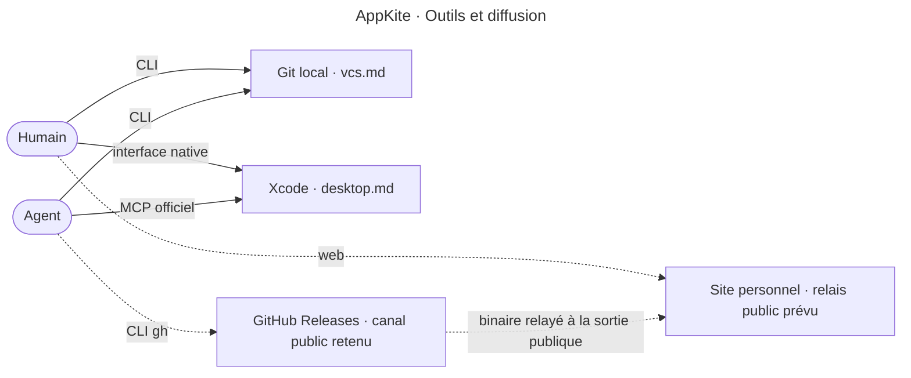

# Ecosystem

```mermaid
---
title: AppKite · Outils et diffusion
---
flowchart LR
    Human(["Humain"])
    Agent(["Agent"])
    Git["Git local · vcs.md"]
    Xcode["Xcode · desktop.md"]
    GitHubReleases["GitHub Releases · canal public retenu"]
    PersonalSite["Site personnel · relais public prévu"]

    Human -- CLI --> Git
    Agent -- CLI --> Git
    Human -- interface native --> Xcode
    Agent -- MCP officiel --> Xcode
    Agent -. CLI gh .-> GitHubReleases
    Human -. web .-> PersonalSite
    GitHubReleases -. binaire relayé à la sortie publique .-> PersonalSite
```
